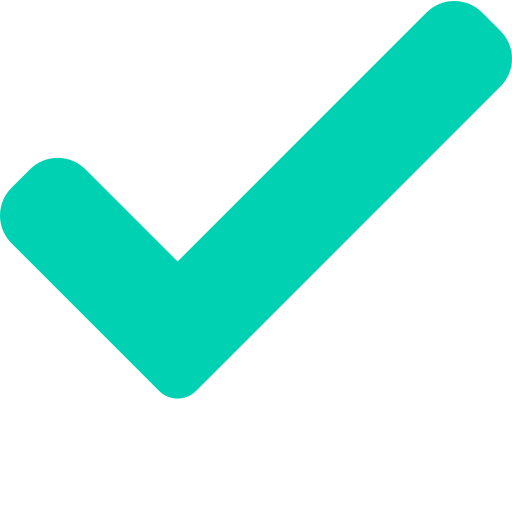

  
  <h1 align="center" style="color: #00d1b2">To do Vue</h1>

  
  
  

<h3 align="center">Liste suas tarefas para não se esquecer delas</h3>

  Acesse aqui: <a href=https://lucasemanuel.github.io/to-do-vue/>To do vue</a>

## ⛏️ Built Using 

- [VueJs](https://vuejs.org/) - Web Framework

## ✍️ Authors 

- [@Lucas Emanuel](https://github.com/lucasemanuel)
